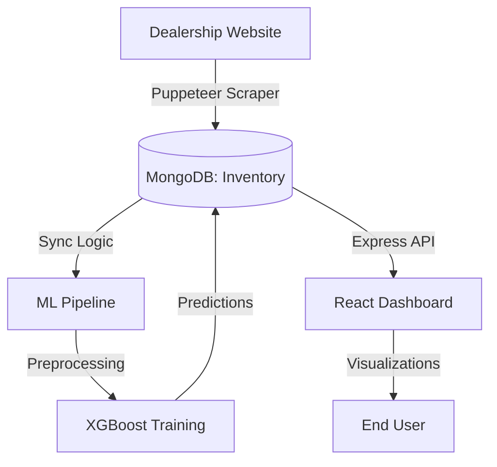

# Technical Documentation: Car Inventory & Prediction System

This document provides a deep dive into the technical architecture, automation logic, machine learning pipeline, and API specifications of the Car Inventory Scraper & Price Prediction System.

---

## 🏗 Architecture Diagram

The system follows a linear data pipeline from extraction to visualization.



---

## 🚀 Project Setup

### Local Installation

1.  **Clone the Repository**:
    ```bash
    git clone <repository-url>
    cd assignment
    ```

2.  **Environment Configuration**:
    Create a `.env` file in the root with:
    ```env
    MONGODB_URI=mongodb://localhost:27017/car_scraper
    PORT=5000
    ```

3.  **Install & Start Backend**:
    ```bash
    cd backend
    npm install
    npm start
    ```

4.  **Install & Start Frontend**:
    ```bash
    cd frontend
    npm install
    npm run dev
    ```

5.  **Setup Python Environment**:
    ```bash
    cd pred_model
    python -m venv venv
    source venv/bin/activate  # or venv\Scripts\activate on Windows
    pip install -r requirements.txt
    ```

---

## 🤖 Machine Learning Model Details

### Model Choice
- **Algorithm**: XGBoost Regressor
- **Rationale**: High performance on structured/tabular data with the ability to handle non-linear relationships between mileage, year, and price.

### Feature Engineering (`preprocess.py`)
- **Title Extraction**: Regex patterns extract `Year`, `Make`, and `Model` from unstructured titles.
- **Categorical Encoding**: `OneHotEncoder` converts `Make`, `Model`, `FuelType`, and `Transmission` into numerical arrays.
- **Scaling**: `StandardScaler` normalizes `Mileage` and `Year`.
- **Handling Missing Values**: Median imputation for numerical fields and "Unknown" tagging for categorical fields.

### Pipeline & Evaluation
The training script (`train_model.py`) splits data into 80/20 train/test sets. 
- **Metrics**: 
  - **MAE (Mean Absolute Error)**: Shows average dollar deviation.
  - **RMSE (Root Mean Square Error)**: Punishes large outliers.
  - **R2 Score**: Indicates variance explanation.

---

## 🔄 Automation & Sync Logic

### GitHub Actions Trigger
The scraper is automated using a GitHub Actions workflow (`.github/workflows/scraper.yml`).
- **Schedule**: `cron: "0 0 * * *"` (Runs daily at midnight UTC).
- **Manual Toggle**: `workflow_dispatch` allows for on-demand syncs.

### Sync Workflow (`sync_engine.py`)
1.  **Extraction**: Scraper pulls raw HTML and parses vehicle attributes.
2.  **Comparison**: 
    - **New Vehicles**: Inserted with `status: "active"` and `first_seen` date.
    - **Existing Vehicles**: Updated with `last_seen` date.
    - **Removed Vehicles**: If a VIN in the DB is missing from the scrape, it's marked `status: "removed"`.
3.  **ML Trigger**: Post-sync, the pipeline retrains the model with the fresh dataset and updates `predicted_price` for all active inventory.

---

## 📡 API Documentation

### Base URL: `http://localhost:5000/api`

#### 1. Get Inventory
`GET /inventory`
- **Query Params**: `status` (Optional, default: `active`)
- **Response**: Array of vehicle objects including `predicted_price`.

#### 2. Get ML Metrics
`GET /ml-metrics`
- **Response**: The latest training results (MAE, RMSE, R2).

### Testing with Postman
1. Set method to `GET`.
2. Enter `http://localhost:5000/api/inventory`.
3. Ensure the backend is running and MongoDB is connected.

---

## ⚠️ Assumptions & Limitations

-   **Assumption**: The dealership website structure remains stable. CSS selectors in `scraper.js` may break if the site updates.
-   **Assumption**: VINs are unique and consistent across listings.
-   **Limitation**: The model requires a minimum threshold of data (e.g., 50+ records) to provide accurate price predictions.
-   **Limitation**: Price predictions do not account for vehicle condition (accidents, wear) as this data isn't available in the scrape.
